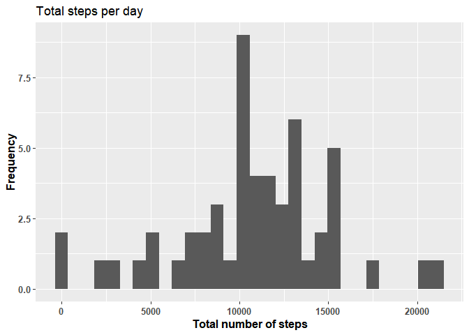
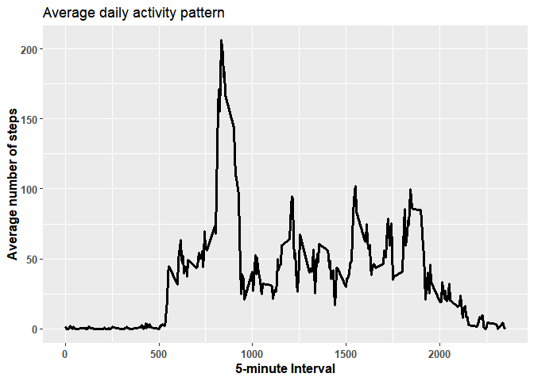
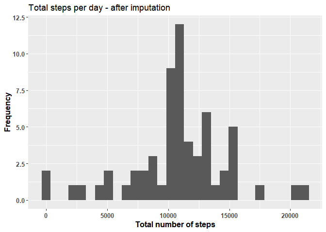
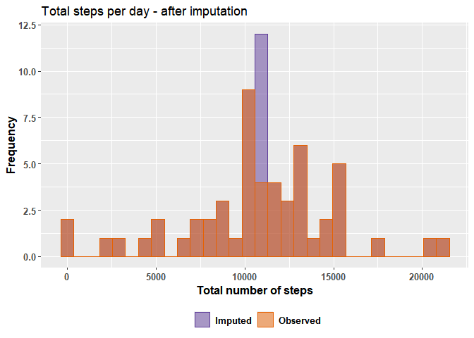
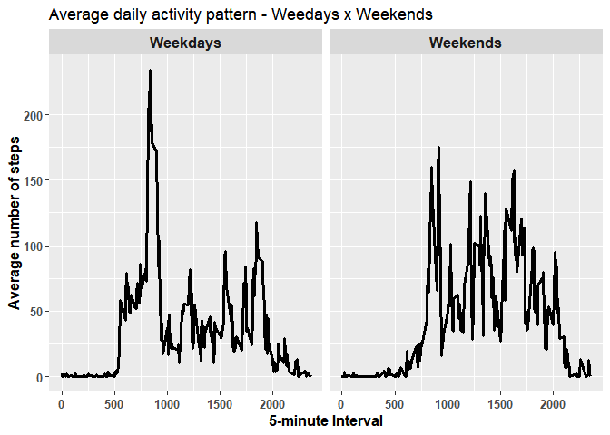

# Introduction

This assignment makes use of data from a personal activity monitoring device. This device collects data at 5 minute intervals through out the day. The data consists of two months of data from an anonymous individual collected during the months of October and November, 2012 and include the number of steps taken in 5 minute intervals each day.

The variables included in this dataset are:

* **steps:** Number of steps taking in a 5-minute interval (missing values are coded as NA)
* **date:** The date on which the measurement was taken in YYYY-MM-DD format
* **interval:** Identifier for the 5-minute interval in which measurement was taken

# Loading and preprocessing the data

The first thing We've done was to create a folder called 'data' to store the dataset.


```r
if(!file.exists("./data")){
    dir.create("./data")
}
```

Then, the idea was to unzip the file, and get the list of files in the folder so we can use it as an argument inside the ***'read.csv'*** function. We also take advantage of the data reading and already convert the date variable to a ***'Date'*** format for future use.


```r
unzip(zipfile = "C:/Users/estev/Downloads/activity.zip",
      exdir = "./data")

path <- file.path("./data") # get folder path
files <- list.files(path, recursive = TRUE) # list files inside directories

## This first line will likely take a few seconds. Be patient!

activity <- read.csv(file.path(path, files[1])) # load file

# Read date variable as date
activity$date <- as.Date(activity$date, "%Y-%m-%d")
```

# What is the mean total number of steps taken per day?

For this part of the assignment, the missing values in the dataset were ignored.

For all the computations, we used the ***'tidyverse'*** package.


```r
# loading package
if(!require(tidyverse)){
    install.packages("tidyverse")
    require(tidyverse)
}
```
1. Calculate the total number of steps taken per day.


```r
activity %>%
    filter(!is.na(steps)) %>%
    select(steps, date) %>%
    group_by(date) %>%
    summarise(total_steps = sum(steps))
```

```
## # A tibble: 53 x 2
##    date       total_steps
##    <date>           <int>
##  1 2012-10-02         126
##  2 2012-10-03       11352
##  3 2012-10-04       12116
##  4 2012-10-05       13294
##  5 2012-10-06       15420
##  6 2012-10-07       11015
##  7 2012-10-09       12811
##  8 2012-10-10        9900
##  9 2012-10-11       10304
## 10 2012-10-12       17382
## # ... with 43 more rows
```

2. Make a histogram of the total number of steps taken each day.


```r
activity %>%
    filter(!is.na(steps)) %>%
    select(steps, date) %>%
    group_by(date) %>%
    summarise(total_steps = sum(steps)) %>%
    ggplot(aes(x = total_steps)) +
    geom_histogram() +
    labs(x = "Total number of steps", y="Frequency",
         title = "Total steps per day") +
    theme(
        axis.title.x = element_text(face="bold", size = 12),
        axis.title.y = element_text(face="bold", size = 12),
        axis.text.x = element_text(face="bold", size = 10),
        axis.text.y = element_text(face="bold", size = 10))
```

<!-- -->

3. Calculate and report the mean and median of the total number of steps taken per day.


```r
# mean
activity %>%
    filter(!is.na(steps)) %>%
    select(steps, date) %>%
    group_by(date) %>%
    summarise(total_steps = sum(steps)) %>%
    ungroup() %>%
    summarise(mean = mean(total_steps))
```

```
## # A tibble: 1 x 1
##     mean
##    <dbl>
## 1 10766.
```

```r
# median
activity %>%
    filter(!is.na(steps)) %>%
    select(steps, date) %>%
    group_by(date) %>%
    summarise(total_steps = sum(steps)) %>%
    ungroup() %>%
    summarise(median = median(total_steps))
```

```
## # A tibble: 1 x 1
##   median
##    <int>
## 1  10765
```
# What is the average daily activity pattern?

1. Make a time series plot (i.e. type = "l") of the 5-minute interval (x-axis) and the average number of steps taken, averaged across all days (y-axis).


```r
activity %>%
    filter(!is.na(steps)) %>%
    select(steps, interval) %>%
    group_by(interval) %>%
    summarise(mean_steps = mean(steps)) %>%
    ggplot(aes(x = interval, y = mean_steps)) +
    geom_line(lwd = 1.2) +
    labs(x = "5-minute Interval", y = "Average number of steps",
         title = "Average daily activity pattern") +
    theme(
        axis.title.x = element_text(face="bold", size = 12),
        axis.title.y = element_text(face="bold", size = 12),
        axis.text.x = element_text(face="bold", size = 10),
        axis.text.y = element_text(face="bold", size = 10))
```

<!-- -->

2. Which 5-minute interval, on average across all the days in the dataset, contains the maximum number of steps?


```r
q5 <- activity %>%
    filter(!is.na(steps)) %>%
    select(steps, interval) %>%
    group_by(interval) %>%
    summarise(mean_steps = mean(steps)) 

q5$interval[which.max(q5$mean_steps)]
```

```
## [1] 835
```

# Imputing missing values

1. Calculate and report the total number of missing values in the dataset (i.e. the total number of rows with NA's).


```r
sapply(activity, function(x){sum(is.na(x))})
```

```
##    steps     date interval 
##     2304        0        0
```

2. Devise a strategy for filling in all of the missing values in the dataset. The strategy does not need to be sophisticated. For example, you could use the mean/median for that day, or the mean for that 5-minute interval, etc.

3.Create a new dataset that is equal to the original dataset but with the missing data filled in.

We can impute the dataset using the overal mean steps.

```r
# overall mean
activity2 <- activity
activity2$steps[which(is.na(activity2$steps))] <- mean(activity2$steps,
                                                       na.rm = TRUE)
```

4. Make a histogram of the total number of steps taken each day and calculate and report the mean and median total number of steps taken per day. Do these values differ from the estimates from the first part of the assignment? What is the impact of imputing missing data on the estimates of the total daily number of steps?


```r
activity2 %>%
    select(steps, date) %>%
    group_by(date) %>%
    summarise(total_steps = sum(steps)) %>%
    ggplot(aes(x = total_steps)) +
    geom_histogram() +
    labs(x = "Total number of steps", y="Frequency",
         title = "Total steps per day - after imputation") +
    theme(
        axis.title.x = element_text(face="bold", size = 12),
        axis.title.y = element_text(face="bold", size = 12),
        axis.text.x = element_text(face="bold", size = 10),
        axis.text.y = element_text(face="bold", size = 10))
```

<!-- -->

Another possibility is to plot both histograms inside the same panel.


```r
## Creating a type variable
activity2$type <- "Imputed"
activity$type <- "Observed"

## appending both data frames into one
all <- rbind(activity, activity2)

# Drawing the histogram with transparency
all %>%
    select(steps, date, type) %>%
    group_by(date, type) %>%
    summarise(total_steps = sum(steps)) %>%
    ggplot(aes(x = total_steps, color = type, fill = type, alpha = type)) +
    geom_histogram(alpha = 0.5, position= "identity") +
    scale_color_manual(values=c("#5e3c99", "#e66101")) +
    scale_fill_manual(values=c("#5e3c99", "#e66101")) +
    scale_alpha_manual(values = c(0.4, 0.5)) +
    labs(x = "Total number of steps", y="Frequency",
         title = "Total steps per day - after imputation") +
    theme(
        axis.title.x = element_text(face="bold", size = 12),
        axis.title.y = element_text(face="bold", size = 12),
        axis.text.x = element_text(face="bold", size = 10),
        axis.text.y = element_text(face="bold", size = 10),
        legend.position = "bottom",
        legend.text = element_text(face="bold", size = 10),
        legend.title = element_blank(),
        legend.justification = "center")
```

<!-- -->

We can see that imputing using the overall mean made the frequency between the 10000-15000 categories change.

# Are there differences in activity patterns between weekdays and weekends?

1. Create a new factor variable in the dataset with two levels – “weekday” and “weekend” indicating whether a given date is a weekday or weekend day.


```r
# change system language to english otherwise days will be in portuguese
Sys.setlocale("LC_ALL","English")
```

```
## [1] "LC_COLLATE=English_United States.1252;LC_CTYPE=English_United States.1252;LC_MONETARY=English_United States.1252;LC_NUMERIC=C;LC_TIME=English_United States.1252"
```

```r
# Specify weekdays and weekends
activity$Day_type <- ifelse(tolower(weekdays(activity$date)) %in% c("saturday","sunday"),"Weekends", "Weekdays")
```


2. Make a panel plot containing a time series plot (i.e. type = "l") of the 5-minute interval (x-axis) and the average number of steps taken, averaged across all weekday days or weekend days (y-axis). See the README file in the GitHub repository to see an example of what this plot should look like using simulated data.


```r
activity %>%
    filter(!is.na(steps)) %>%
    select(steps, interval, Day_type) %>%
    group_by(interval, Day_type) %>%
    summarise(mean_steps = mean(steps)) %>%
    ggplot(aes(x = interval, y = mean_steps)) +
    geom_line(lwd = 1.2) +
    facet_grid( ~ Day_type) +
    labs(x = "5-minute Interval", y = "Average number of steps",
         title = "Average daily activity pattern - Weedays x Weekends") +
    theme(
        axis.title.x = element_text(face="bold", size = 12),
        axis.title.y = element_text(face="bold", size = 12),
        axis.text.x = element_text(face="bold", size = 10),
        axis.text.y = element_text(face="bold", size = 10),
        strip.text.x = element_text(face="bold", size = 12))
```

<!-- -->

